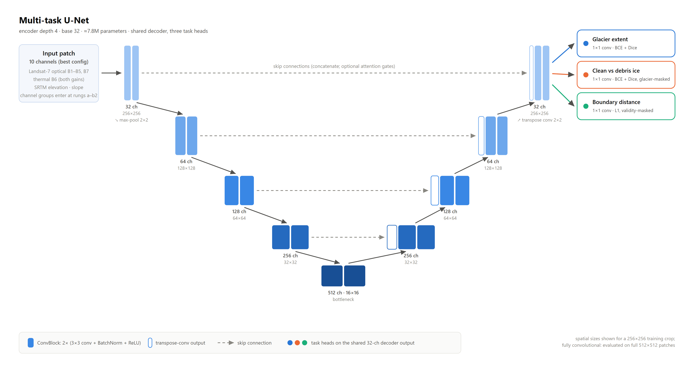

# Multi-Task U-Net for Himalayan Glacier Mapping

From-scratch PyTorch implementation of a three-headed U-Net that maps glacier
extent, discriminates clean from debris-covered ice, and regresses distance to
the nearest glacier boundary, trained on the
[HKH Glacier Mapping dataset](https://lila.science/datasets/hkh-glacier-mapping/)
(Landsat-7 + SRTM, expert labels by ICIMOD).

Coursework project for STW7088CEM Artificial Neural Networks (Softwarica /
Coventry University). Author: Shishir Kandel (250619).



## Results

Trained under a frozen, zero-leakage geographic split (verified zero footprint
overlap, 0.15 deg train buffer). Test and east zones were each evaluated exactly
once, after all model selection.

| Zone | Glacier IoU | Debris IoU | Macro-F1 | Dist MAE |
|---|---|---|---|---|
| Validation (best rung f) | 0.665 | 0.259 | 0.732 | 4.4 px |
| Validation (final checkpoint) | 0.655 | 0.234 | 0.716 | 4.3 px |
| Test, unseen region (one-shot) | 0.402 | 0.132 | 0.595 | 5.2 px |
| East, OOD (one-shot) | 0.494 | 0.193 | 0.665 | 2.6 px |

The performance is attributed, not just obtained: a nine-rung ablation ladder
(configs `a` through `f`) adds one change at a time. Key findings: terrain
channels produce the first debris signal; Dice loss plus debris oversampling
amplify it; the auxiliary boundary-distance regression head improves both
classification tasks; a focal/pos-weight stack on top of Dice actively hurts
(isolated in rung `d2b`).

## Repository layout

```
data.py            shard-backed dataset: dequantisation, train-stats normalisation,
                   validity masking, crops/flips/rot90 + spectral jitter
model.py           U-Net from scratch; optional attention gates; prior-logit head init
losses.py          masked BCE/Dice/focal + masked L1 distance loss
train.py           training loop, smoothed checkpoint selection, metrics.jsonl logging
eval.py            one-shot masked evaluation (confusion matrix, IoU/Dice/F1, dist MAE)
configs/           one YAML per ablation rung (a, b1, b2, c, d1, d2, e1, e2, f, final)
```

## Reproducing

1. Download `hkh_patches.tar.gz` from the LILA link above (74 GB).
2. Curate and shard: filter patches by validity, uint16-quantise per band, pack
   per-scene npz shards with distance-transform targets (the pipeline, split
   contract and SHA-256 checksums are documented in the report's reproduction
   appendix).
3. Train a rung: `python train.py --config configs/f.yaml --data <shards>`
4. Evaluate: `python eval.py --ckpt runs/f/f/best.pt --zone test --data <shards>`

All runs used seed 20260716 on a Kaggle T4 (the whole ladder costs about 3.5
GPU-hours). The exact per-rung logs and device-visible run evidence are in the
report appendices.
